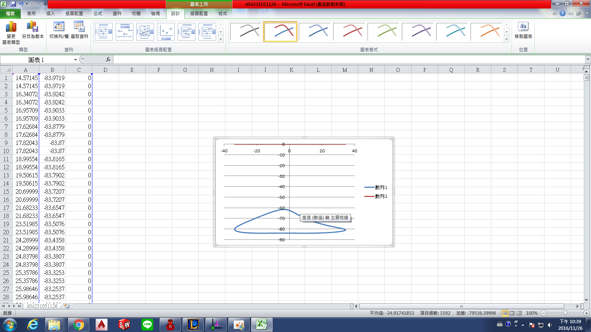
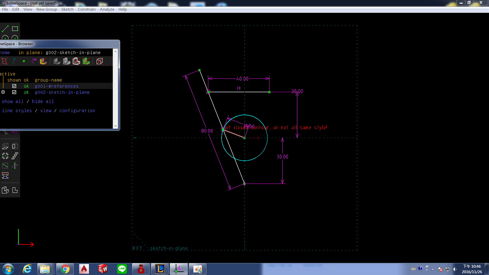
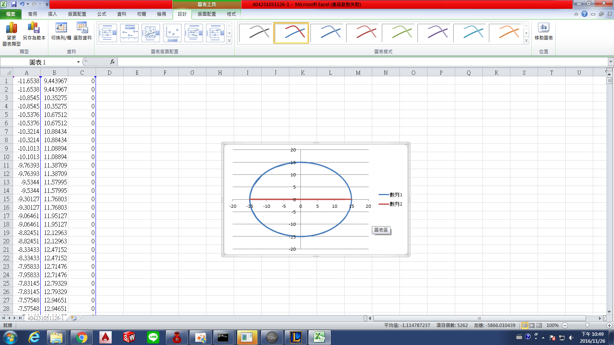

Title: 40423109 w18電腦輔助設計實習課程總結
Date: 2016-01-12 
Category: Misc
Tags: 使用導引, 創造力, 表達能力, 協同設計
Author: 40423109

<!-- PELICAN_END_SUMMARY -->

##個人操作影片

## 2. 零件組立

<iframe src="https://player.vimeo.com/video/199020105" width="640" height="360" frameborder="0" webkitallowfullscreen mozallowfullscreen allowfullscreen></iframe>

<a href="https://vimeo.com/199020105">組件示範</a> from <a href="https://vimeo.com/user61136461">mark ho</a> on <a href="https://vimeo.com">Vimeo</a>.

##平面四連桿機構模擬影片

<iframe src="https://player.vimeo.com/video/199017594" width="640" height="363" frameborder="0" webkitallowfullscreen mozallowfullscreen allowfullscreen></iframe>

<a href="https://vimeo.com/199017594">平面四連桿機構模擬</a> from <a href="https://vimeo.com/user61136461">mark ho</a> on <a href="https://vimeo.com">Vimeo</a>.

##onshape連桿組裝影片

<iframe src="https://player.vimeo.com/video/198168561" width="640" height="414" frameborder="0" webkitallowfullscreen mozallowfullscreen allowfullscreen></iframe>

<a href="https://vimeo.com/198168561">40423109  onshape 連桿組裝影片</a> from <a href="https://vimeo.com/user61136461">mark ho</a> on <a href="https://vimeo.com">Vimeo</a>.

##示範零件

<iframe src="https://player.vimeo.com/video/199020522" width="640" height="354" frameborder="0" webkitallowfullscreen mozallowfullscreen allowfullscreen></iframe>

<a href="https://vimeo.com/199020522">onshape 示範畫零件</a> from <a href="https://vimeo.com/user61136461">mark ho</a> on <a href="https://vimeo.com">Vimeo</a>.

##3D印表機組裝影片
<iframe src="https://player.vimeo.com/video/198168555" width="640" height="342" frameborder="0" webkitallowfullscreen mozallowfullscreen allowfullscreen></iframe>

<a href="https://vimeo.com/198168555">40423109   3D印表機組裝影片</a> from <a href="https://vimeo.com/user61136461">mark ho</a> on <a href="https://vimeo.com">Vimeo</a>.

##印表機

<iframe src="./../data/20161217-2.html" width="800" height="600"></iframe>

##組合圖

<iframe src="./../data/1201.html" width="800" height="600"></iframe>

## Extrude (平行長出或除料)

<iframe src="./../data/404231091.html" width="800" height="600"></iframe>

## Lathe (旋轉繞行長出或除料)

<iframe src="./../data/40423109.html" width="800" height="600"></iframe>

## 3. Linkages (fourbar & multilink) (四連桿與多連桿運動模擬)

##組合圖

<iframe src="./../data/1201.html" width="800" height="600"></iframe>

##Solvedspace

##Excel

##支架

<iframe src="./../data/20161217.html" width="800" height="600"></iframe>

##連桿

<iframe src="./../data/20161217-1.html" width="800" height="600"></iframe>

##底盤

<iframe src="./../data/20161217-5.html" width="800" height="600"></iframe>

##圓盤

<iframe src="./../data/20161217-3.html" width="800" height="600"></iframe>

##印表機

<iframe src="./../data/20161217-2.html" width="800" height="600"></iframe>

