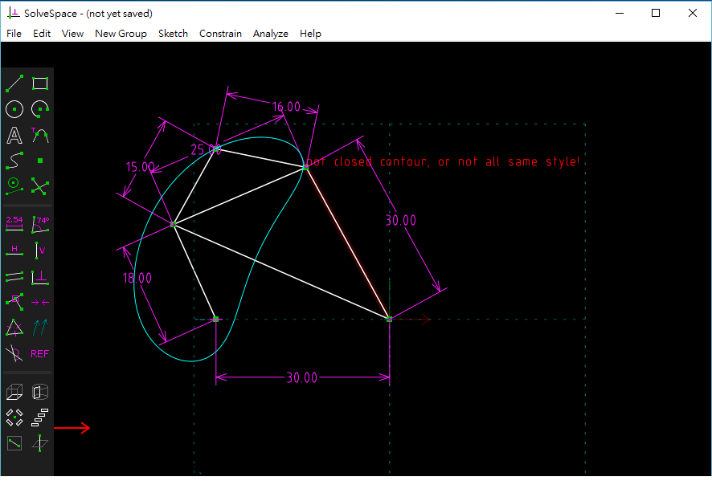

Title: 40423109 w14 4連桿Excel超級製圖員
Date: 2016-11-17
Category: Misc
Tags: 使用導引, 創造力, 表達能力, 協同設計
Author: 40423109

<!-- PELICAN_END_SUMMARY -->

##Solvedspace

##Excel

##平面四連桿機構模擬影片
<iframe src="https://player.vimeo.com/video/199017594" width="640" height="363" frameborder="0" webkitallowfullscreen mozallowfullscreen allowfullscreen></iframe>

<a href="https://vimeo.com/199017594">平面四連桿機構模擬</a> from <a href="https://vimeo.com/user61136461">mark ho</a> on <a href="https://vimeo.com">Vimeo</a>.
